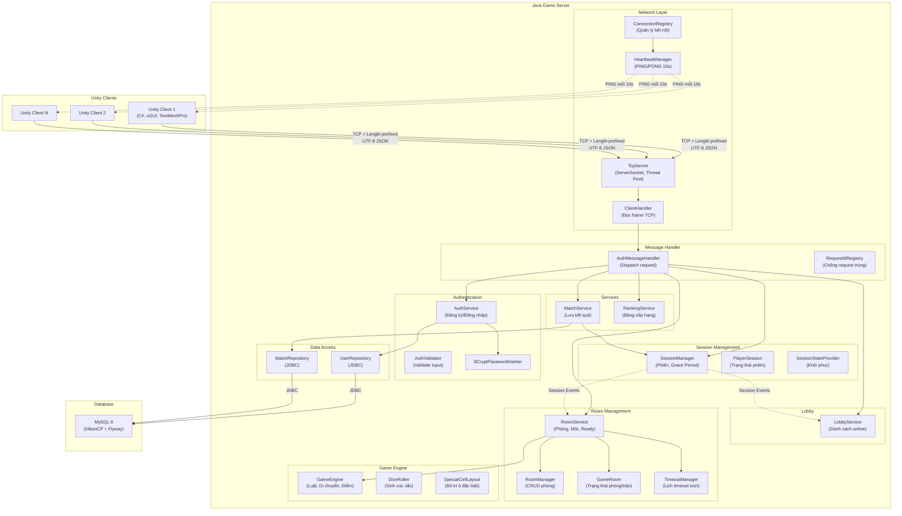

# Sơ đồ Kiến trúc Hệ thống

## Kiến trúc tổng quan

```mermaid
graph TB
    subgraph Clients["Unity Clients"]
        C1["Unity Client 1<br/>(C#, uGUI, TextMeshPro)"]
        C2["Unity Client 2"]
        CN["Unity Client N"]
    end

    subgraph Server["Java Game Server"]
        subgraph Network["Network Layer"]
            TCP["TcpServer<br/>(ServerSocket, Thread Pool)"]
            CH["ClientHandler<br/>(Đọc frame TCP)"]
            CR["ConnectionRegistry<br/>(Quản lý kết nối)"]
            HB["HeartbeatManager<br/>(PING/PONG 10s)"]
        end

        subgraph Handler["Message Handler"]
            AMH["AuthMessageHandler<br/>(Dispatch request)"]
            RID["RequestIdRegistry<br/>(Chống request trùng)"]
        end

        subgraph Auth["Authentication"]
            AS["AuthService<br/>(Đăng ký/Đăng nhập)"]
            AV["AuthValidator<br/>(Validate input)"]
            BC["BCryptPasswordHasher"]
        end

        subgraph Session["Session Management"]
            SM["SessionManager<br/>(Phiên, Grace Period)"]
            PS["PlayerSession<br/>(Trạng thái phiên)"]
            SSP["SessionStateProvider<br/>(Khôi phục)"]
        end

        subgraph Lobby["Lobby"]
            LS["LobbyService<br/>(Danh sách online)"]
        end

        subgraph Room["Room Management"]
            RS["RoomService<br/>(Phòng, Mời, Ready)"]
            RM["RoomManager<br/>(CRUD phòng)"]
            GR["GameRoom<br/>(Trạng thái phòng/trận)"]
            TM["TimeoutManager<br/>(Lịch timeout lượt)"]
        end

        subgraph Game["Game Engine"]
            GE["GameEngine<br/>(Luật, Di chuyển, Điểm)"]
            DR["DiceRoller<br/>(Sinh xúc xắc)"]
            SCL["SpecialCellLayout<br/>(Bố trí ô đặc biệt)"]
        end

        subgraph Service["Services"]
            MS["MatchService<br/>(Lưu kết quả)"]
            RKS["RankingService<br/>(Bảng xếp hạng)"]
        end

        subgraph Repository["Data Access"]
            UR["UserRepository<br/>(JDBC)"]
            MR["MatchRepository<br/>(JDBC)"]
        end
    end

    subgraph DB["Database"]
        MySQL["MySQL 8<br/>(HikariCP + Flyway)"]
    end

    C1 & C2 & CN -->|"TCP + Length-prefixed<br/>UTF-8 JSON"| TCP
    TCP --> CH
    CH --> AMH
    AMH --> AS & SM & LS & RS & MS & RKS
    RS --> RM & GR & GE & TM
    AS --> UR & BC
    MS --> MR & SM
    UR & MR -->|"JDBC"| MySQL
    HB -.->|"PING mỗi 10s"| C1 & C2 & CN
    SM -.->|"Session Events"| LS & RS
    CR --> HB
```

## Phân tầng trách nhiệm

```mermaid
graph LR
    subgraph L1["Tầng Mạng"]
        direction TB
        A1["TcpServer"]
        A2["ClientHandler"]
        A3["ClientConnection"]
        A4["HeartbeatManager"]
        A5["ConnectionRegistry"]
    end

    subgraph L2["Tầng Xử lý Message"]
        direction TB
        B1["AuthMessageHandler"]
        B2["RequestIdRegistry"]
        B3["PayloadMapper"]
        B4["MessageFactory"]
    end

    subgraph L3["Tầng Nghiệp vụ"]
        direction TB
        C1["AuthService"]
        C2["SessionManager"]
        C3["LobbyService"]
        C4["RoomService"]
        C5["MatchService"]
        C6["RankingService"]
    end

    subgraph L4["Tầng Game Logic"]
        direction TB
        D1["GameEngine"]
        D2["GameRoom"]
        D3["DiceRoller"]
        D4["SpecialCellLayout"]
    end

    subgraph L5["Tầng Dữ liệu"]
        direction TB
        E1["UserRepository"]
        E2["MatchRepository"]
        E3["MySQL 8"]
    end

    L1 --> L2 --> L3 --> L4
    L3 --> L5
```
