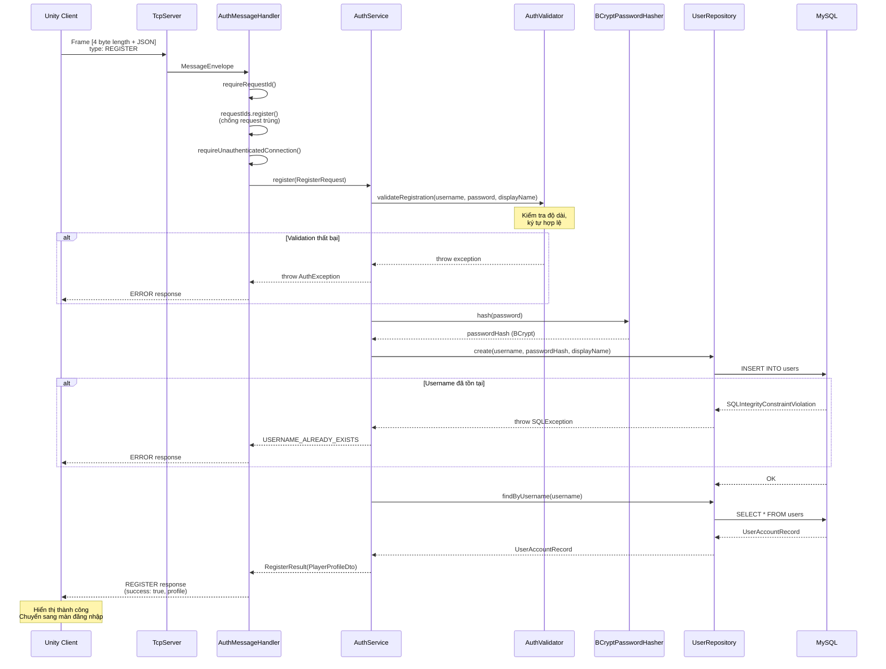
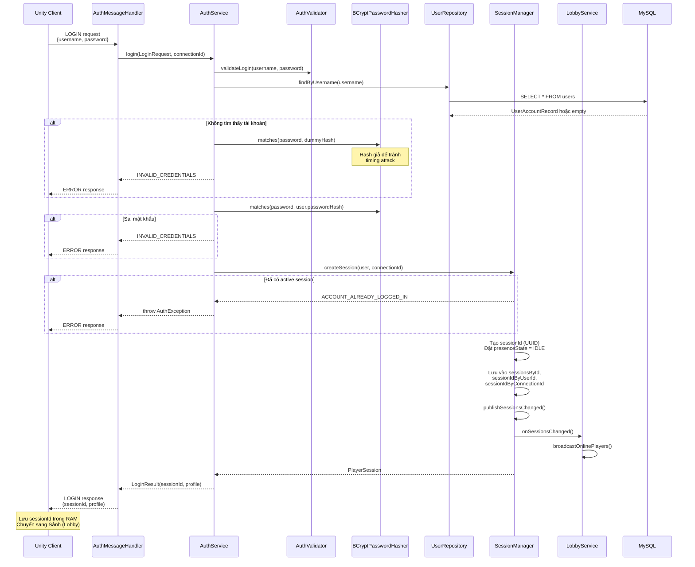
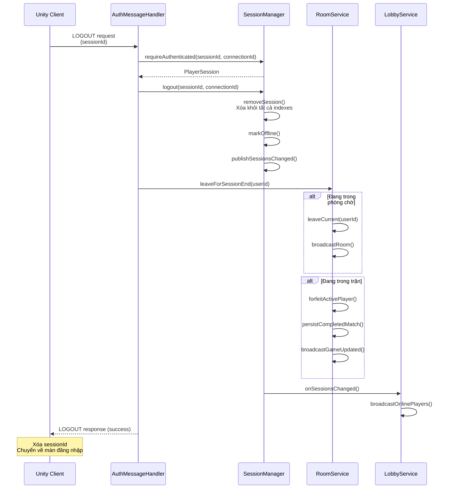

# Sơ đồ Đăng ký & Đăng nhập

## Luồng Đăng ký (REGISTER)

```mermaid
sequenceDiagram
    participant C as Unity Client
    participant TCP as TcpServer
    participant AMH as AuthMessageHandler
    participant AS as AuthService
    participant AV as AuthValidator
    participant PH as BCryptPasswordHasher
    participant UR as UserRepository
    participant DB as MySQL

    C->>TCP: Frame [4 byte length + JSON]<br/>type: REGISTER
    TCP->>AMH: MessageEnvelope
    AMH->>AMH: requireRequestId()
    AMH->>AMH: requestIds.register()<br/>(chống request trùng)
    AMH->>AMH: requireUnauthenticatedConnection()
    AMH->>AS: register(RegisterRequest)

    AS->>AV: validateRegistration(username, password, displayName)
    Note over AV: Kiểm tra độ dài,<br/>ký tự hợp lệ

    alt Validation thất bại
        AV-->>AS: throw exception
        AS-->>AMH: throw AuthException
        AMH-->>C: ERROR response
    end

    AS->>PH: hash(password)
    PH-->>AS: passwordHash (BCrypt)

    AS->>UR: create(username, passwordHash, displayName)
    UR->>DB: INSERT INTO users
    
    alt Username đã tồn tại
        DB-->>UR: SQLIntegrityConstraintViolation
        UR-->>AS: throw SQLException
        AS-->>AMH: USERNAME_ALREADY_EXISTS
        AMH-->>C: ERROR response
    end

    DB-->>UR: OK
    AS->>UR: findByUsername(username)
    UR->>DB: SELECT * FROM users
    DB-->>UR: UserAccountRecord
    UR-->>AS: UserAccountRecord

    AS-->>AMH: RegisterResult(PlayerProfileDto)
    AMH-->>C: REGISTER response<br/>(success: true, profile)

    Note over C: Hiển thị thành công<br/>Chuyển sang màn đăng nhập
```

## Luồng Đăng nhập (LOGIN)

```mermaid
sequenceDiagram
    participant C as Unity Client
    participant AMH as AuthMessageHandler
    participant AS as AuthService
    participant AV as AuthValidator
    participant PH as BCryptPasswordHasher
    participant UR as UserRepository
    participant SM as SessionManager
    participant LS as LobbyService
    participant DB as MySQL

    C->>AMH: LOGIN request<br/>{username, password}
    AMH->>AS: login(LoginRequest, connectionId)

    AS->>AV: validateLogin(username, password)
    AS->>UR: findByUsername(username)
    UR->>DB: SELECT * FROM users
    DB-->>UR: UserAccountRecord hoặc empty

    alt Không tìm thấy tài khoản
        AS->>PH: matches(password, dummyHash)
        Note over PH: Hash giả để tránh<br/>timing attack
        AS-->>AMH: INVALID_CREDENTIALS
        AMH-->>C: ERROR response
    end

    AS->>PH: matches(password, user.passwordHash)

    alt Sai mật khẩu
        AS-->>AMH: INVALID_CREDENTIALS
        AMH-->>C: ERROR response
    end

    AS->>SM: createSession(user, connectionId)

    alt Đã có active session
        SM-->>AS: ACCOUNT_ALREADY_LOGGED_IN
        AS-->>AMH: throw AuthException
        AMH-->>C: ERROR response
    end

    SM->>SM: Tạo sessionId (UUID)<br/>Đặt presenceState = IDLE
    SM->>SM: Lưu vào sessionsById,<br/>sessionIdByUserId,<br/>sessionIdByConnectionId
    SM->>SM: publishSessionsChanged()
    SM->>LS: onSessionsChanged()
    LS->>LS: broadcastOnlinePlayers()

    SM-->>AS: PlayerSession
    AS-->>AMH: LoginResult(sessionId, profile)
    AMH-->>C: LOGIN response<br/>(sessionId, profile)

    Note over C: Lưu sessionId trong RAM<br/>Chuyển sang Sảnh (Lobby)
```

## Luồng Đăng xuất (LOGOUT)

```mermaid
sequenceDiagram
    participant C as Unity Client
    participant AMH as AuthMessageHandler
    participant SM as SessionManager
    participant RS as RoomService
    participant LS as LobbyService

    C->>AMH: LOGOUT request<br/>{sessionId}
    AMH->>SM: requireAuthenticated(sessionId, connectionId)
    SM-->>AMH: PlayerSession

    AMH->>SM: logout(sessionId, connectionId)
    SM->>SM: removeSession()<br/>Xóa khỏi tất cả indexes
    SM->>SM: markOffline()
    SM->>SM: publishSessionsChanged()

    AMH->>RS: leaveForSessionEnd(userId)
    
    alt Đang trong phòng chờ
        RS->>RS: leaveCurrent(userId)
        RS->>RS: broadcastRoom()
    end
    
    alt Đang trong trận
        RS->>RS: forfeitActivePlayer()
        RS->>RS: persistCompletedMatch()
        RS->>RS: broadcastGameUpdated()
    end

    SM->>LS: onSessionsChanged()
    LS->>LS: broadcastOnlinePlayers()

    AMH-->>C: LOGOUT response (success)

    Note over C: Xóa sessionId<br/>Chuyển về màn đăng nhập
```
