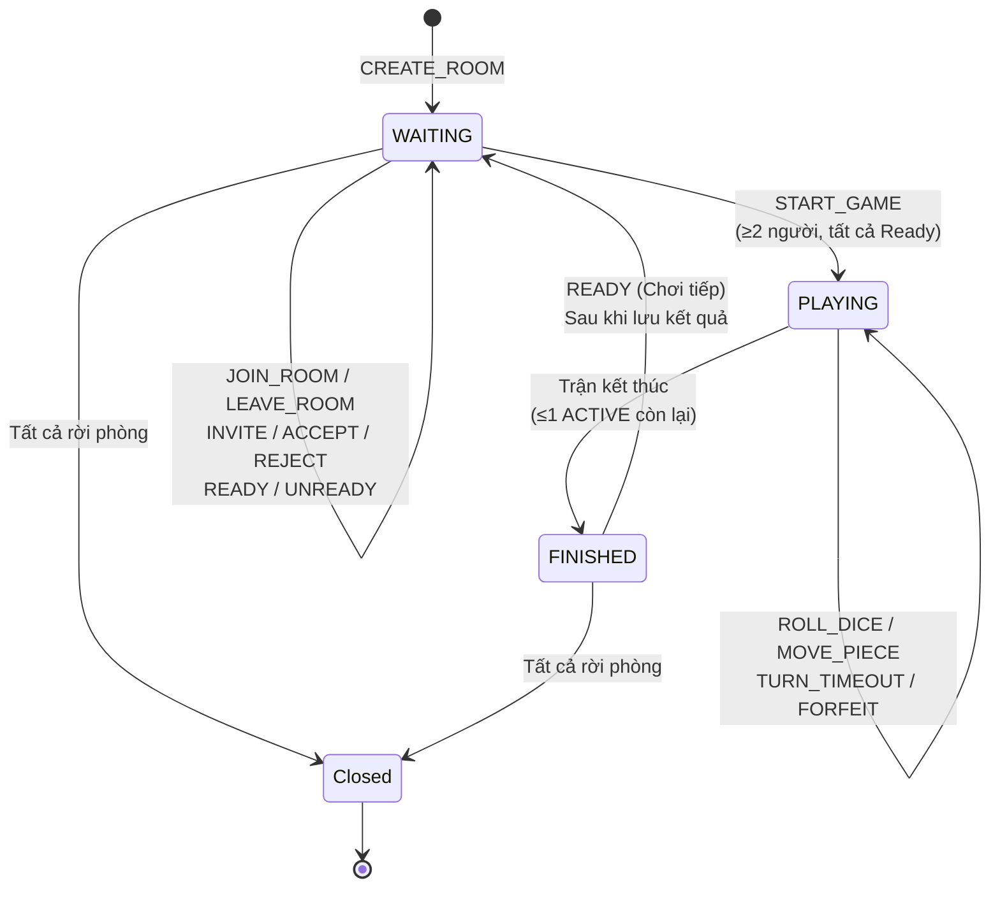
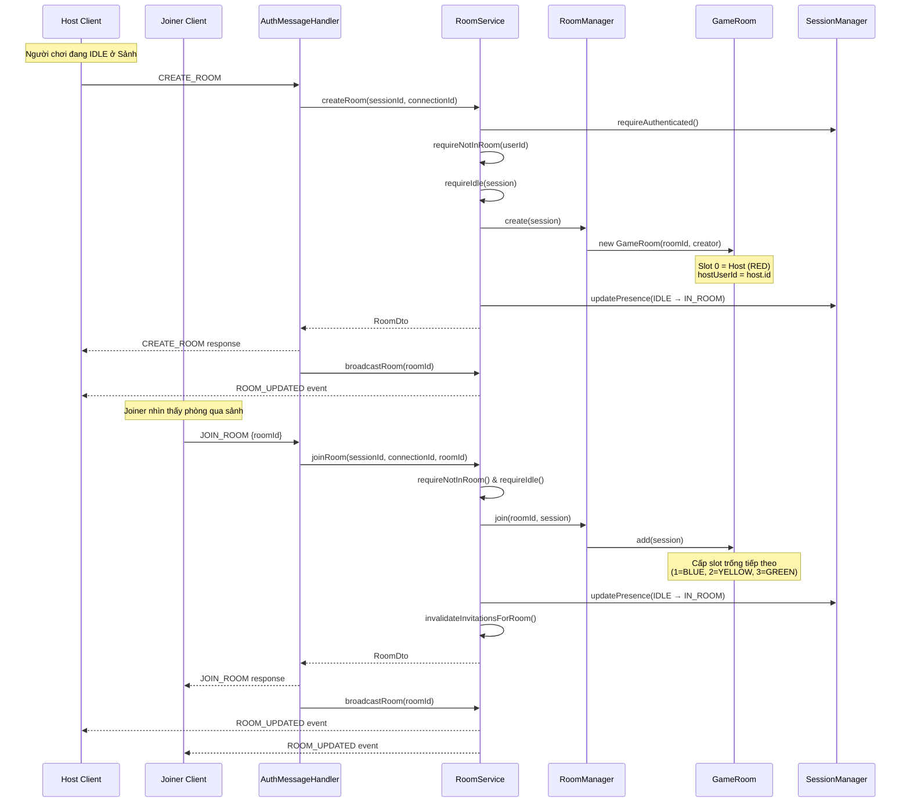
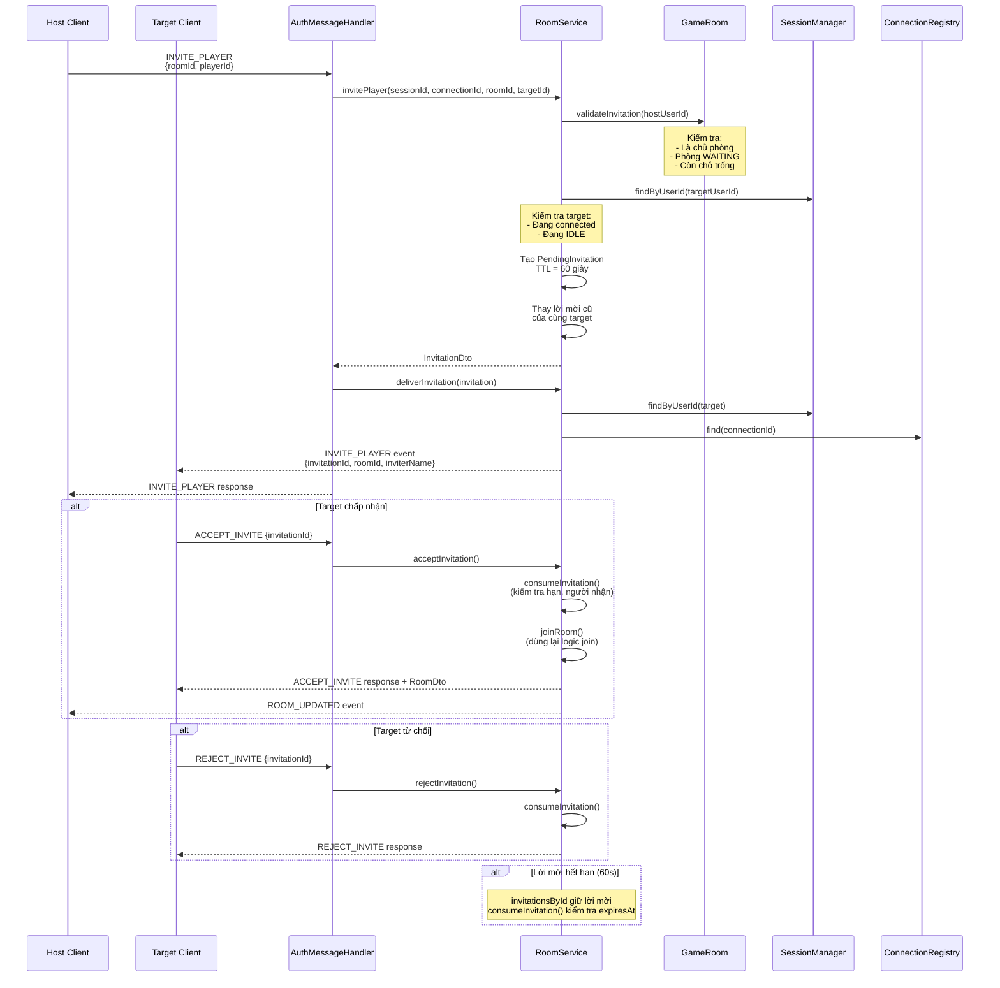
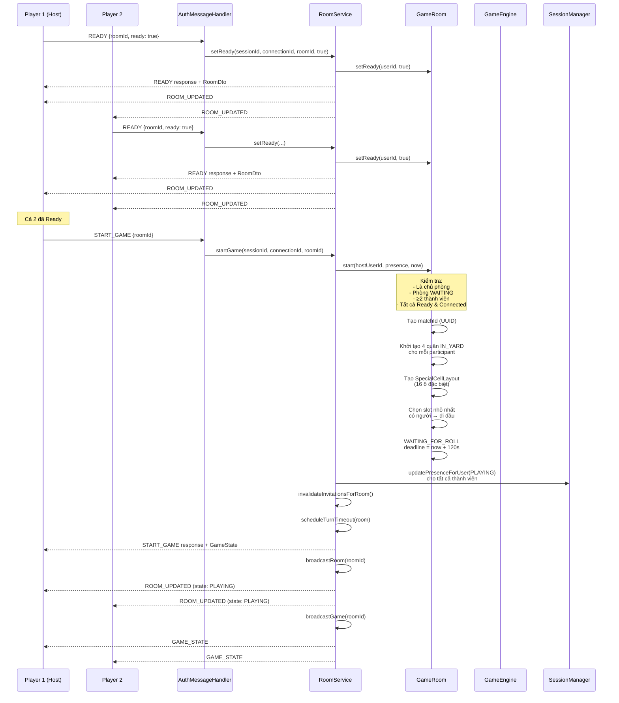
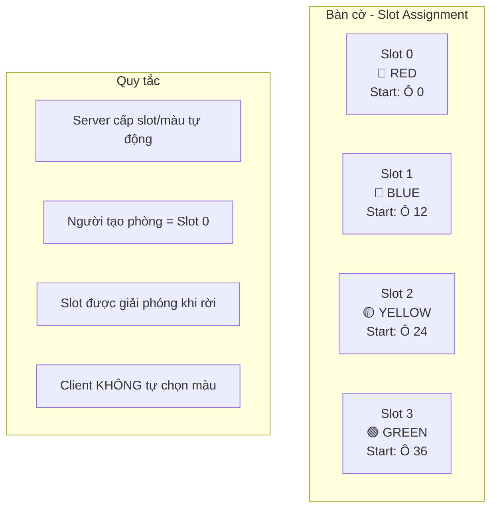

# Sơ đồ Quản lý Phòng

## Vòng đời Phòng (Room State)

```mermaid
stateDiagram-v2
    [*] --> WAITING: CREATE_ROOM
    
    WAITING --> WAITING: JOIN_ROOM / LEAVE_ROOM<br/>INVITE / ACCEPT / REJECT<br/>READY / UNREADY
    WAITING --> PLAYING: START_GAME<br/>(≥2 người, tất cả Ready)
    WAITING --> Closed: Tất cả rời phòng

    PLAYING --> PLAYING: ROLL_DICE / MOVE_PIECE<br/>TURN_TIMEOUT / FORFEIT
    PLAYING --> FINISHED: Trận kết thúc<br/>(≤1 ACTIVE còn lại)

    FINISHED --> WAITING: READY (Chơi tiếp)<br/>Sau khi lưu kết quả
    FINISHED --> Closed: Tất cả rời phòng

    Closed --> [*]
```

## Luồng Tạo & Tham gia Phòng

```mermaid
sequenceDiagram
    participant Host as Host Client
    participant Joiner as Joiner Client
    participant AMH as AuthMessageHandler
    participant RS as RoomService
    participant RM as RoomManager
    participant GR as GameRoom
    participant SM as SessionManager

    Note over Host: Người chơi đang IDLE ở Sảnh

    Host->>AMH: CREATE_ROOM
    AMH->>RS: createRoom(sessionId, connectionId)
    RS->>SM: requireAuthenticated()
    RS->>RS: requireNotInRoom(userId)
    RS->>RS: requireIdle(session)
    RS->>RM: create(session)
    RM->>GR: new GameRoom(roomId, creator)
    Note over GR: Slot 0 = Host (RED)<br/>hostUserId = host.id
    RS->>SM: updatePresence(IDLE → IN_ROOM)
    RS-->>AMH: RoomDto
    AMH-->>Host: CREATE_ROOM response
    AMH->>RS: broadcastRoom(roomId)
    RS-->>Host: ROOM_UPDATED event

    Note over Joiner: Joiner nhìn thấy phòng qua sảnh

    Joiner->>AMH: JOIN_ROOM {roomId}
    AMH->>RS: joinRoom(sessionId, connectionId, roomId)
    RS->>RS: requireNotInRoom() & requireIdle()
    RS->>RM: join(roomId, session)
    RM->>GR: add(session)
    Note over GR: Cấp slot trống tiếp theo<br/>(1=BLUE, 2=YELLOW, 3=GREEN)
    RS->>SM: updatePresence(IDLE → IN_ROOM)
    RS->>RS: invalidateInvitationsForRoom()
    RS-->>AMH: RoomDto
    AMH-->>Joiner: JOIN_ROOM response
    AMH->>RS: broadcastRoom(roomId)
    RS-->>Host: ROOM_UPDATED event
    RS-->>Joiner: ROOM_UPDATED event
```

## Luồng Mời Người chơi

```mermaid
sequenceDiagram
    participant Host as Host Client
    participant Target as Target Client
    participant AMH as AuthMessageHandler
    participant RS as RoomService
    participant GR as GameRoom
    participant SM as SessionManager
    participant CR as ConnectionRegistry

    Host->>AMH: INVITE_PLAYER<br/>{roomId, playerId}
    AMH->>RS: invitePlayer(sessionId, connectionId, roomId, targetId)
    
    RS->>GR: validateInvitation(hostUserId)
    Note over GR: Kiểm tra:<br/>- Là chủ phòng<br/>- Phòng WAITING<br/>- Còn chỗ trống

    RS->>SM: findByUserId(targetUserId)
    Note over RS: Kiểm tra target:<br/>- Đang connected<br/>- Đang IDLE

    RS->>RS: Tạo PendingInvitation<br/>TTL = 60 giây
    RS->>RS: Thay lời mời cũ<br/>của cùng target

    RS-->>AMH: InvitationDto
    AMH->>RS: deliverInvitation(invitation)
    RS->>SM: findByUserId(target)
    RS->>CR: find(connectionId)
    RS-->>Target: INVITE_PLAYER event<br/>{invitationId, roomId, inviterName}

    AMH-->>Host: INVITE_PLAYER response

    alt Target chấp nhận
        Target->>AMH: ACCEPT_INVITE {invitationId}
        AMH->>RS: acceptInvitation()
        RS->>RS: consumeInvitation()<br/>(kiểm tra hạn, người nhận)
        RS->>RS: joinRoom()<br/>(dùng lại logic join)
        RS-->>Target: ACCEPT_INVITE response + RoomDto
        RS-->>Host: ROOM_UPDATED event
    end

    alt Target từ chối
        Target->>AMH: REJECT_INVITE {invitationId}
        AMH->>RS: rejectInvitation()
        RS->>RS: consumeInvitation()
        RS-->>Target: REJECT_INVITE response
    end

    alt Lời mời hết hạn (60s)
        Note over RS: invitationsById giữ lời mời<br/>consumeInvitation() kiểm tra expiresAt
    end
```

## Luồng Ready & Bắt đầu Trận

```mermaid
sequenceDiagram
    participant P1 as Player 1 (Host)
    participant P2 as Player 2
    participant AMH as AuthMessageHandler
    participant RS as RoomService
    participant GR as GameRoom
    participant GE as GameEngine
    participant SM as SessionManager

    P1->>AMH: READY {roomId, ready: true}
    AMH->>RS: setReady(sessionId, connectionId, roomId, true)
    RS->>GR: setReady(userId, true)
    RS-->>P1: READY response + RoomDto
    RS-->>P1: ROOM_UPDATED
    RS-->>P2: ROOM_UPDATED

    P2->>AMH: READY {roomId, ready: true}
    AMH->>RS: setReady(...)
    RS->>GR: setReady(userId, true)
    RS-->>P2: READY response + RoomDto
    RS-->>P1: ROOM_UPDATED
    RS-->>P2: ROOM_UPDATED

    Note over P1: Cả 2 đã Ready

    P1->>AMH: START_GAME {roomId}
    AMH->>RS: startGame(sessionId, connectionId, roomId)
    RS->>GR: start(hostUserId, presence, now)

    Note over GR: Kiểm tra:<br/>- Là chủ phòng<br/>- Phòng WAITING<br/>- ≥2 thành viên<br/>- Tất cả Ready & Connected

    GR->>GR: Tạo matchId (UUID)
    GR->>GR: Khởi tạo 4 quân IN_YARD<br/>cho mỗi participant
    GR->>GR: Tạo SpecialCellLayout<br/>(16 ô đặc biệt)
    GR->>GR: Chọn slot nhỏ nhất<br/>có người → đi đầu
    GR->>GR: WAITING_FOR_ROLL<br/>deadline = now + 120s

    RS->>SM: updatePresenceForUser(PLAYING)<br/>cho tất cả thành viên
    RS->>RS: invalidateInvitationsForRoom()
    RS->>RS: scheduleTurnTimeout(room)

    RS-->>P1: START_GAME response + GameState
    RS->>RS: broadcastRoom(roomId)
    RS-->>P1: ROOM_UPDATED (state: PLAYING)
    RS-->>P2: ROOM_UPDATED (state: PLAYING)
    RS->>RS: broadcastGame(roomId)
    RS-->>P1: GAME_STATE
    RS-->>P2: GAME_STATE
```

## Slot & Màu sắc

```mermaid
graph TB
    subgraph Board["Bàn cờ - Slot Assignment"]
        S0["Slot 0<br/>🔴 RED<br/>Start: Ô 0"]
        S1["Slot 1<br/>🔵 BLUE<br/>Start: Ô 12"]
        S2["Slot 2<br/>🟡 YELLOW<br/>Start: Ô 24"]
        S3["Slot 3<br/>🟢 GREEN<br/>Start: Ô 36"]
    end

    subgraph Rules["Quy tắc"]
        R1["Server cấp slot/màu tự động"]
        R2["Người tạo phòng = Slot 0"]
        R3["Slot được giải phóng khi rời"]
        R4["Client KHÔNG tự chọn màu"]
    end
```
