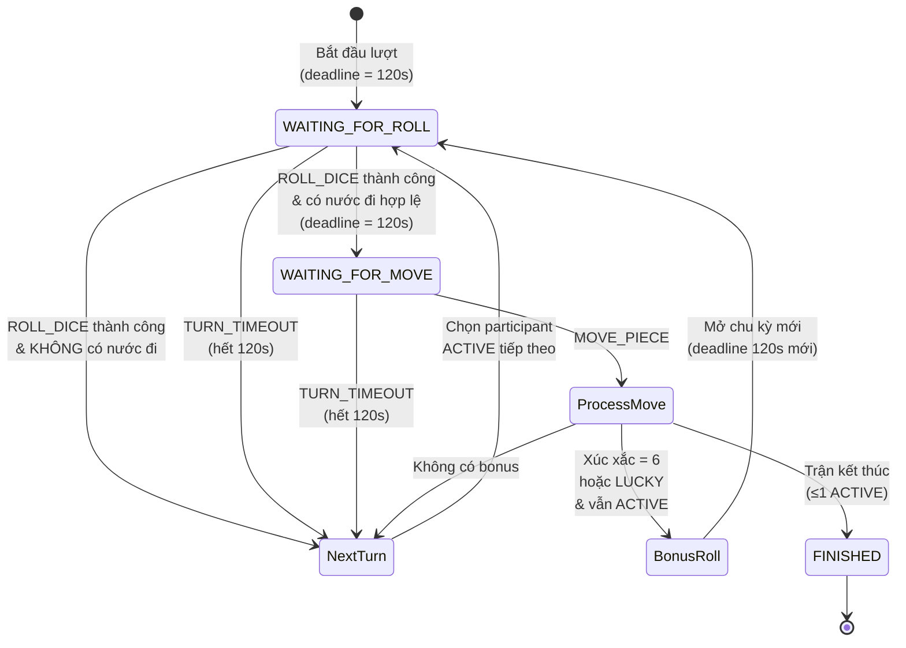
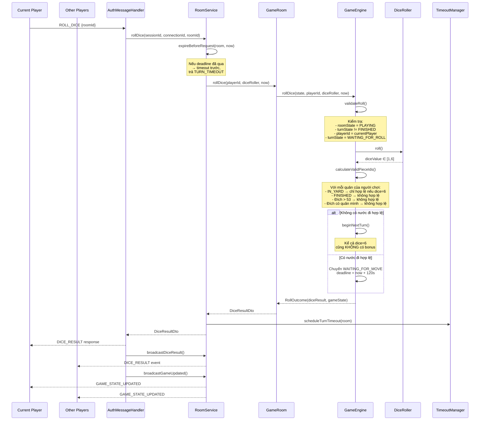
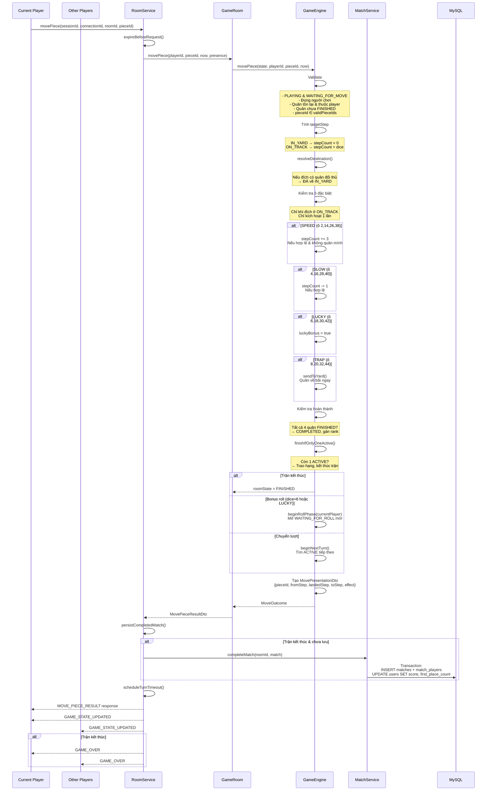
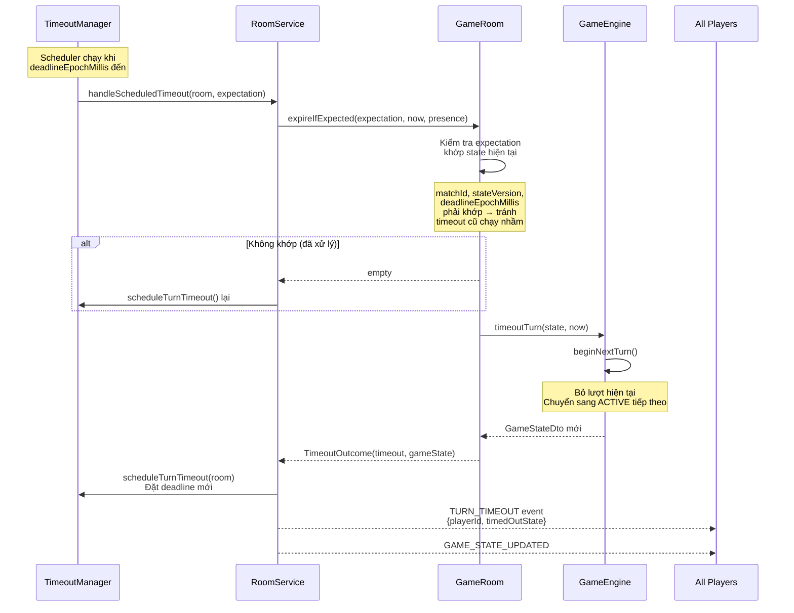
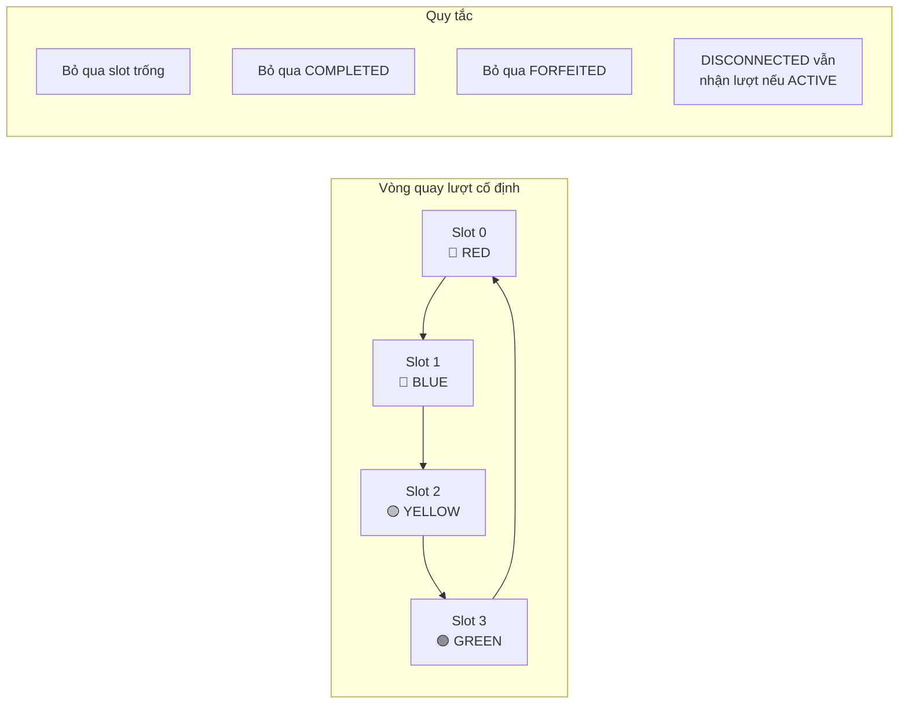

# Sơ đồ Gameplay — Lượt chơi

## Luồng tổng quan một lượt

```mermaid
stateDiagram-v2
    [*] --> WAITING_FOR_ROLL: Bắt đầu lượt<br/>(deadline = 120s)

    WAITING_FOR_ROLL --> WAITING_FOR_MOVE: ROLL_DICE thành công<br/>& có nước đi hợp lệ<br/>(deadline = 120s)
    WAITING_FOR_ROLL --> NextTurn: ROLL_DICE thành công<br/>& KHÔNG có nước đi
    WAITING_FOR_ROLL --> NextTurn: TURN_TIMEOUT<br/>(hết 120s)

    WAITING_FOR_MOVE --> ProcessMove: MOVE_PIECE
    WAITING_FOR_MOVE --> NextTurn: TURN_TIMEOUT<br/>(hết 120s)

    ProcessMove --> BonusRoll: Xúc xắc = 6<br/>hoặc LUCKY<br/>& vẫn ACTIVE
    ProcessMove --> NextTurn: Không có bonus
    ProcessMove --> FINISHED: Trận kết thúc<br/>(≤1 ACTIVE)

    BonusRoll --> WAITING_FOR_ROLL: Mở chu kỳ mới<br/>(deadline 120s mới)

    NextTurn --> WAITING_FOR_ROLL: Chọn participant<br/>ACTIVE tiếp theo

    FINISHED --> [*]
```

## Luồng chi tiết: Tung xúc xắc (ROLL_DICE)

```mermaid
sequenceDiagram
    participant P as Current Player
    participant Others as Other Players
    participant AMH as AuthMessageHandler
    participant RS as RoomService
    participant GR as GameRoom
    participant GE as GameEngine
    participant DR as DiceRoller
    participant TM as TimeoutManager

    P->>AMH: ROLL_DICE {roomId}
    AMH->>RS: rollDice(sessionId, connectionId, roomId)
    
    RS->>RS: expireBeforeRequest(room, now)
    Note over RS: Nếu deadline đã qua<br/>→ timeout trước,<br/>trả TURN_TIMEOUT

    RS->>GR: rollDice(playerId, diceRoller, now)
    GR->>GE: rollDice(state, playerId, diceRoller, now)

    GE->>GE: validateRoll()
    Note over GE: Kiểm tra:<br/>- roomState = PLAYING<br/>- turnState != FINISHED<br/>- playerId = currentPlayer<br/>- turnState = WAITING_FOR_ROLL

    GE->>DR: roll()
    DR-->>GE: diceValue ∈ [1,6]

    GE->>GE: calculateValidPieceIds()
    Note over GE: Với mỗi quân của người chơi:<br/>- IN_YARD → chỉ hợp lệ nếu dice=6<br/>- FINISHED → không hợp lệ<br/>- Đích > 53 → không hợp lệ<br/>- Đích có quân mình → không hợp lệ

    alt Không có nước đi hợp lệ
        GE->>GE: beginNextTurn()
        Note over GE: Kể cả dice=6<br/>cũng KHÔNG có bonus
    else Có nước đi hợp lệ
        GE->>GE: Chuyển WAITING_FOR_MOVE<br/>deadline = now + 120s
    end

    GE-->>GR: RollOutcome(diceResult, gameState)
    GR-->>RS: DiceResultDto

    RS->>TM: scheduleTurnTimeout(room)

    RS-->>AMH: DiceResultDto
    AMH-->>P: DICE_RESULT response
    AMH->>RS: broadcastDiceResult()
    RS-->>Others: DICE_RESULT event
    AMH->>RS: broadcastGameUpdated()
    RS-->>P: GAME_STATE_UPDATED
    RS-->>Others: GAME_STATE_UPDATED
```

## Luồng chi tiết: Di chuyển quân (MOVE_PIECE)

```mermaid
sequenceDiagram
    participant P as Current Player
    participant Others as Other Players
    participant RS as RoomService
    participant GR as GameRoom
    participant GE as GameEngine
    participant MS as MatchService
    participant DB as MySQL

    P->>RS: movePiece(sessionId, connectionId, roomId, pieceId)
    RS->>RS: expireBeforeRequest()
    RS->>GR: movePiece(playerId, pieceId, now, presence)
    GR->>GE: movePiece(state, playerId, pieceId, now)

    GE->>GE: Validate
    Note over GE: - PLAYING & WAITING_FOR_MOVE<br/>- Đúng người chơi<br/>- Quân tồn tại & thuộc player<br/>- Quân chưa FINISHED<br/>- pieceId ∈ validPieceIds

    GE->>GE: Tính targetStep
    Note over GE: IN_YARD → stepCount = 0<br/>ON_TRACK → stepCount + dice

    GE->>GE: resolveDestination()
    Note over GE: Nếu đích có quân đối thủ<br/>→ ĐÁ về IN_YARD

    GE->>GE: Kiểm tra ô đặc biệt
    Note over GE: Chỉ khi đích ở ON_TRACK<br/>Chỉ kích hoạt 1 lần

    alt SPEED (ô 2,14,26,38)
        GE->>GE: stepCount += 3<br/>Nếu hợp lệ & không quân mình
    end
    alt SLOW (ô 4,16,28,40)
        GE->>GE: stepCount -= 1<br/>Nếu hợp lệ
    end
    alt LUCKY (ô 6,18,30,42)
        GE->>GE: luckyBonus = true
    end
    alt TRAP (ô 8,20,32,44)
        GE->>GE: sendToYard()<br/>Quân về bãi ngay
    end

    GE->>GE: Kiểm tra hoàn thành
    Note over GE: Tất cả 4 quân FINISHED?<br/>→ COMPLETED, gán rank

    GE->>GE: finishIfOnlyOneActive()
    Note over GE: Còn 1 ACTIVE?<br/>→ Trao hạng, kết thúc trận

    alt Trận kết thúc
        GE-->>GR: roomState = FINISHED
    else Bonus roll (dice=6 hoặc LUCKY)
        GE->>GE: beginRollPhase(currentPlayer)<br/>Mở WAITING_FOR_ROLL mới
    else Chuyển lượt
        GE->>GE: beginNextTurn()<br/>Tìm ACTIVE tiếp theo
    end

    GE->>GE: Tạo MovePresentationDto<br/>{pieceId, fromStep, landedStep, toStep, effect}
    GE-->>GR: MoveOutcome

    GR-->>RS: MovePieceResultDto

    RS->>RS: persistCompletedMatch()
    alt Trận kết thúc & chưa lưu
        RS->>MS: completeMatch(roomId, match)
        MS->>DB: Transaction:<br/>INSERT matches + match_players<br/>UPDATE users SET score, first_place_count
    end

    RS->>RS: scheduleTurnTimeout()

    RS-->>P: MOVE_PIECE_RESULT response
    RS-->>P: GAME_STATE_UPDATED
    RS-->>Others: GAME_STATE_UPDATED

    alt Trận kết thúc
        RS-->>P: GAME_OVER
        RS-->>Others: GAME_OVER
    end
```

## Luồng Timeout

```mermaid
sequenceDiagram
    participant TM as TimeoutManager
    participant RS as RoomService
    participant GR as GameRoom
    participant GE as GameEngine
    participant Players as All Players

    Note over TM: Scheduler chạy khi<br/>deadlineEpochMillis đến

    TM->>RS: handleScheduledTimeout(room, expectation)
    RS->>GR: expireIfExpected(expectation, now, presence)

    GR->>GR: Kiểm tra expectation<br/>khớp state hiện tại
    Note over GR: matchId, stateVersion,<br/>deadlineEpochMillis<br/>phải khớp → tránh<br/>timeout cũ chạy nhầm

    alt Không khớp (đã xử lý)
        GR-->>RS: empty
        RS->>TM: scheduleTurnTimeout() lại
    end

    GR->>GE: timeoutTurn(state, now)
    GE->>GE: beginNextTurn()
    Note over GE: Bỏ lượt hiện tại<br/>Chuyển sang ACTIVE tiếp theo

    GE-->>GR: GameStateDto mới
    GR-->>RS: TimeoutOutcome(timeout, gameState)

    RS->>TM: scheduleTurnTimeout(room)<br/>Đặt deadline mới

    RS-->>Players: TURN_TIMEOUT event<br/>{playerId, timedOutState}
    RS-->>Players: GAME_STATE_UPDATED
```

## Thứ tự lượt

```mermaid
graph LR
    subgraph TurnOrder["Vòng quay lượt cố định"]
        S0["Slot 0<br/>🔴 RED"] --> S1["Slot 1<br/>🔵 BLUE"]
        S1 --> S2["Slot 2<br/>🟡 YELLOW"]
        S2 --> S3["Slot 3<br/>🟢 GREEN"]
        S3 --> S0
    end

    subgraph Rules["Quy tắc"]
        R1["Bỏ qua slot trống"]
        R2["Bỏ qua COMPLETED"]
        R3["Bỏ qua FORFEITED"]
        R4["DISCONNECTED vẫn<br/>nhận lượt nếu ACTIVE"]
    end
```
