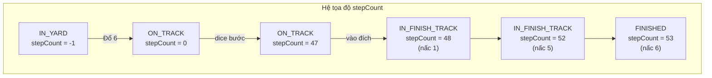
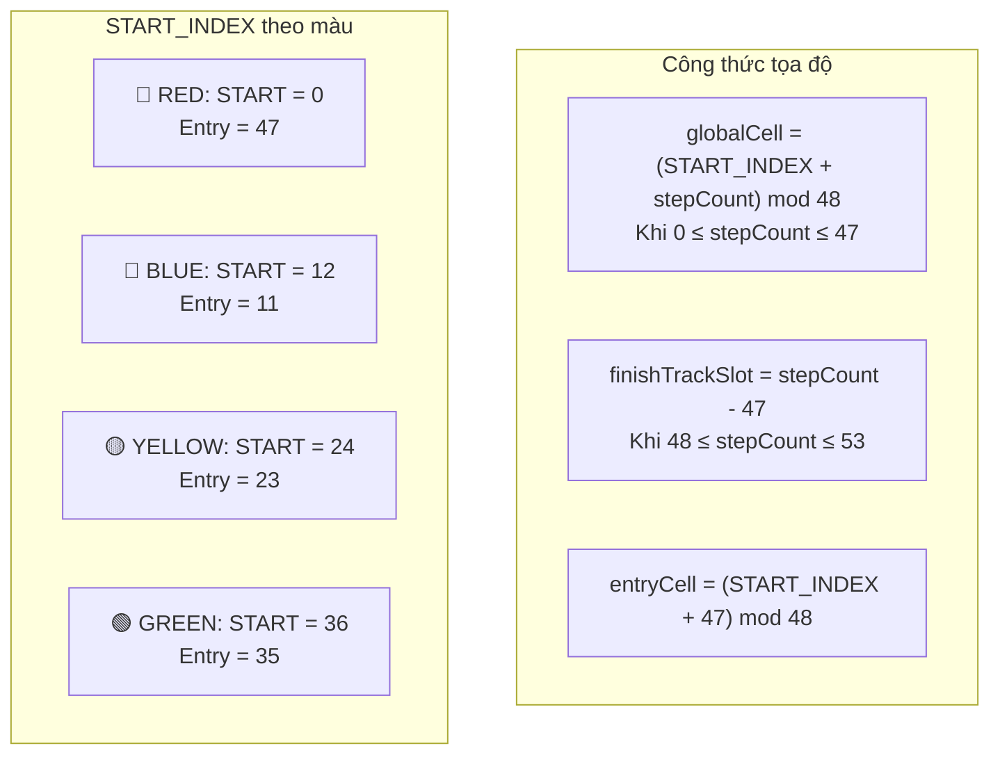
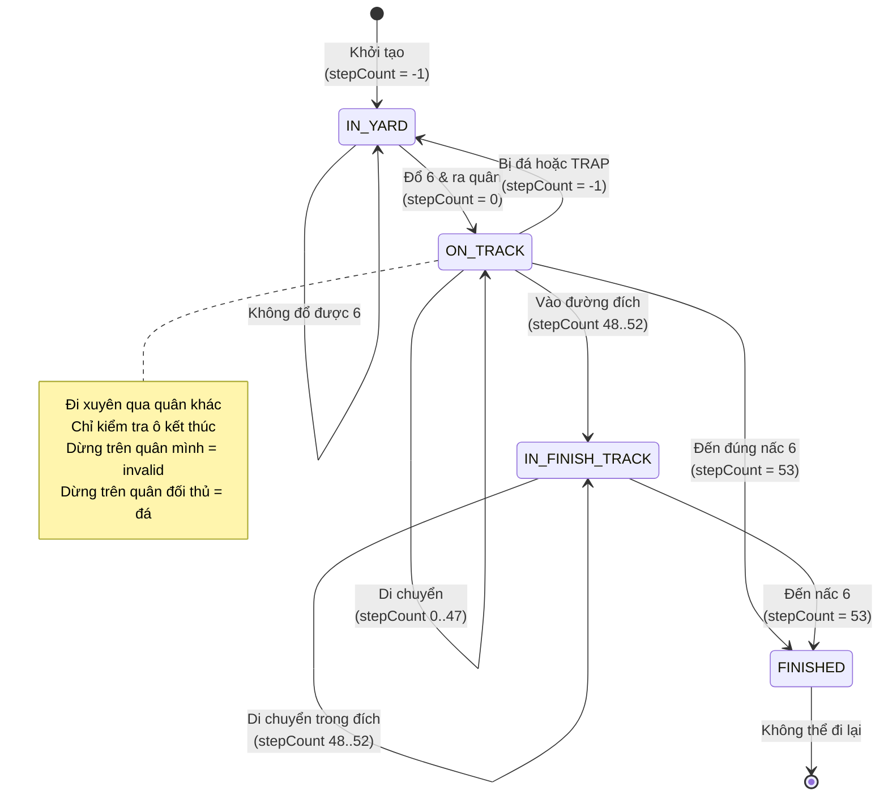
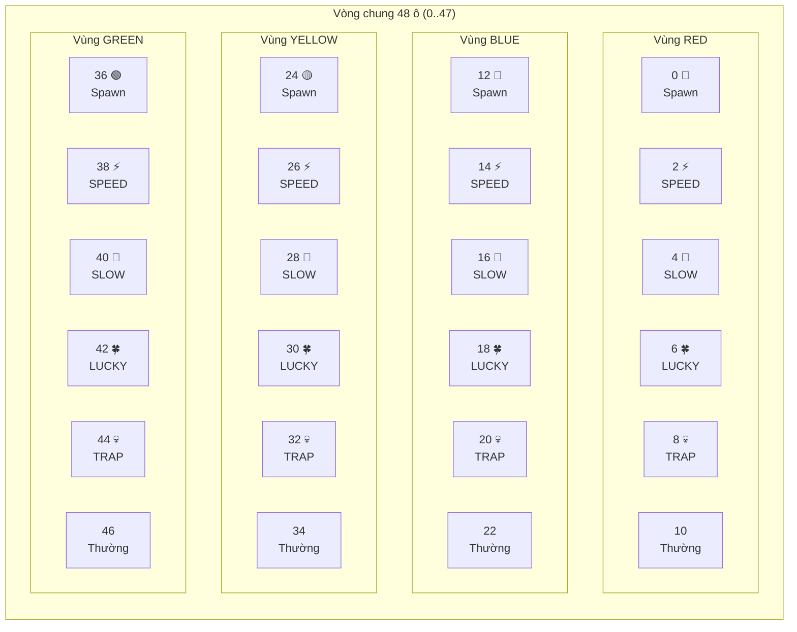
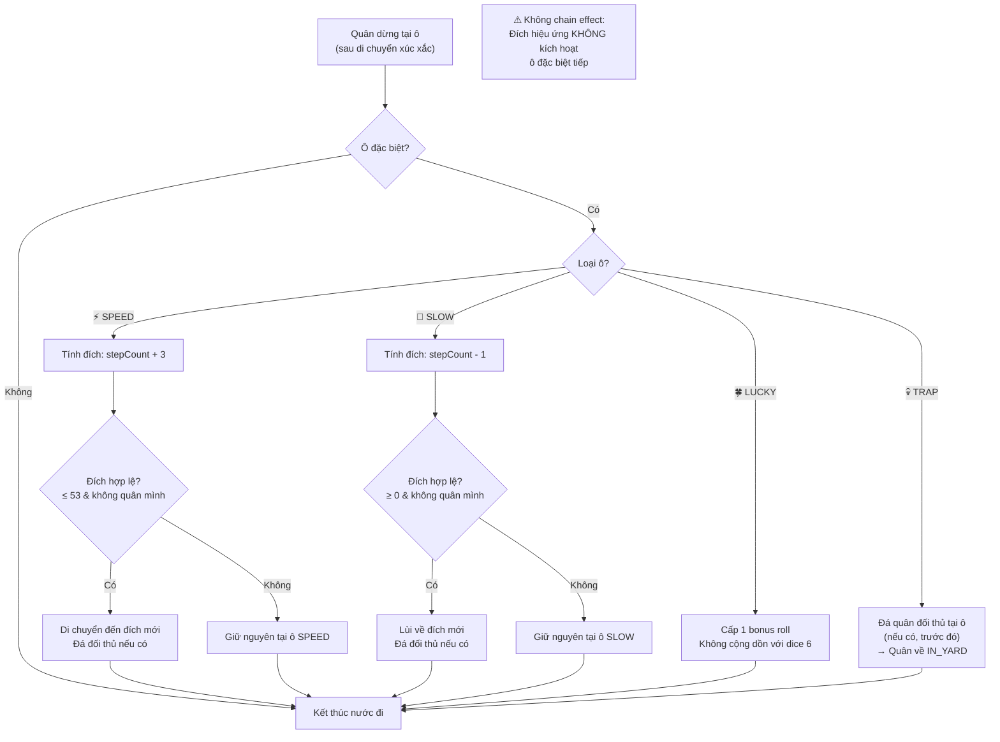

# Sơ đồ Bàn cờ, Quân cờ & Ô đặc biệt

## Tọa độ Bàn cờ

```mermaid
graph TB
    subgraph Coordinate["Hệ tọa độ stepCount"]
        direction LR
        Y["IN_YARD<br/>stepCount = -1"]
        T0["ON_TRACK<br/>stepCount = 0"]
        T47["ON_TRACK<br/>stepCount = 47"]
        F48["IN_FINISH_TRACK<br/>stepCount = 48<br/>(nấc 1)"]
        F52["IN_FINISH_TRACK<br/>stepCount = 52<br/>(nấc 5)"]
        F53["FINISHED<br/>stepCount = 53<br/>(nấc 6)"]

        Y -->|"Đổ 6"| T0
        T0 -->|"dice bước"| T47
        T47 -->|"vào đích"| F48
        F48 --> F52
        F52 --> F53
    end
```

## Công thức chuyển đổi tọa độ

```mermaid
graph TD
    subgraph Formula["Công thức tọa độ"]
        GC["globalCell = (START_INDEX + stepCount) mod 48<br/>Khi 0 ≤ stepCount ≤ 47"]
        FT["finishTrackSlot = stepCount - 47<br/>Khi 48 ≤ stepCount ≤ 53"]
        EC["entryCell = (START_INDEX + 47) mod 48"]
    end

    subgraph Colors["START_INDEX theo màu"]
        RED["🔴 RED: START = 0<br/>Entry = 47"]
        BLUE["🔵 BLUE: START = 12<br/>Entry = 11"]
        YELLOW["🟡 YELLOW: START = 24<br/>Entry = 23"]
        GREEN["🟢 GREEN: START = 36<br/>Entry = 35"]
    end
```

## Trạng thái Quân cờ (PieceState)

```mermaid
stateDiagram-v2
    [*] --> IN_YARD: Khởi tạo<br/>(stepCount = -1)

    IN_YARD --> ON_TRACK: Đổ 6 & ra quân<br/>(stepCount = 0)
    IN_YARD --> IN_YARD: Không đổ được 6

    ON_TRACK --> ON_TRACK: Di chuyển<br/>(stepCount 0..47)
    ON_TRACK --> IN_YARD: Bị đá hoặc TRAP<br/>(stepCount = -1)
    ON_TRACK --> IN_FINISH_TRACK: Vào đường đích<br/>(stepCount 48..52)
    ON_TRACK --> FINISHED: Đến đúng nấc 6<br/>(stepCount = 53)

    IN_FINISH_TRACK --> IN_FINISH_TRACK: Di chuyển trong đích<br/>(stepCount 48..52)
    IN_FINISH_TRACK --> FINISHED: Đến nấc 6<br/>(stepCount = 53)

    FINISHED --> [*]: Không thể đi lại

    note right of ON_TRACK
        Đi xuyên qua quân khác
        Chỉ kiểm tra ô kết thúc
        Dừng trên quân mình = invalid
        Dừng trên quân đối thủ = đá
    end note
```

## Bố trí Ô đặc biệt (48 ô vòng chung)

```mermaid
graph LR
    subgraph Ring["Vòng chung 48 ô (0..47)"]
        subgraph RED_Zone["Vùng RED"]
            R0["0 🔴<br/>Spawn"]
            R2["2 ⚡<br/>SPEED"]
            R4["4 🐌<br/>SLOW"]
            R6["6 🍀<br/>LUCKY"]
            R8["8 💀<br/>TRAP"]
            R10["10<br/>Thường"]
        end

        subgraph BLUE_Zone["Vùng BLUE"]
            B12["12 🔵<br/>Spawn"]
            B14["14 ⚡<br/>SPEED"]
            B16["16 🐌<br/>SLOW"]
            B18["18 🍀<br/>LUCKY"]
            B20["20 💀<br/>TRAP"]
            B22["22<br/>Thường"]
        end

        subgraph YELLOW_Zone["Vùng YELLOW"]
            Y24["24 🟡<br/>Spawn"]
            Y26["26 ⚡<br/>SPEED"]
            Y28["28 🐌<br/>SLOW"]
            Y30["30 🍀<br/>LUCKY"]
            Y32["32 💀<br/>TRAP"]
            Y34["34<br/>Thường"]
        end

        subgraph GREEN_Zone["Vùng GREEN"]
            G36["36 🟢<br/>Spawn"]
            G38["38 ⚡<br/>SPEED"]
            G40["40 🐌<br/>SLOW"]
            G42["42 🍀<br/>LUCKY"]
            G44["44 💀<br/>TRAP"]
            G46["46<br/>Thường"]
        end
    end
```

## Hiệu ứng Ô đặc biệt

```mermaid
flowchart TD
    Land["Quân dừng tại ô<br/>(sau di chuyển xúc xắc)"]

    Land --> Check{"Ô đặc biệt?"}
    Check -->|Không| Done["Kết thúc nước đi"]
    Check -->|Có| Type{"Loại ô?"}

    Type -->|"⚡ SPEED"| SpeedCalc["Tính đích: stepCount + 3"]
    SpeedCalc --> SpeedValid{"Đích hợp lệ?<br/>≤ 53 & không quân mình"}
    SpeedValid -->|Có| SpeedMove["Di chuyển đến đích mới<br/>Đá đối thủ nếu có"]
    SpeedValid -->|Không| SpeedStay["Giữ nguyên tại ô SPEED"]
    SpeedMove --> Done
    SpeedStay --> Done

    Type -->|"🐌 SLOW"| SlowCalc["Tính đích: stepCount - 1"]
    SlowCalc --> SlowValid{"Đích hợp lệ?<br/>≥ 0 & không quân mình"}
    SlowValid -->|Có| SlowMove["Lùi về đích mới<br/>Đá đối thủ nếu có"]
    SlowValid -->|Không| SlowStay["Giữ nguyên tại ô SLOW"]
    SlowMove --> Done
    SlowStay --> Done

    Type -->|"🍀 LUCKY"| Lucky["Cấp 1 bonus roll<br/>Không cộng dồn với dice 6"]
    Lucky --> Done

    Type -->|"💀 TRAP"| Trap["Đá quân đối thủ tại ô<br/>(nếu có, trước đó)<br/>→ Quân về IN_YARD"]
    Trap --> Done

    Note1["⚠ Không chain effect:<br/>Đích hiệu ứng KHÔNG kích hoạt<br/>ô đặc biệt tiếp"]
```
