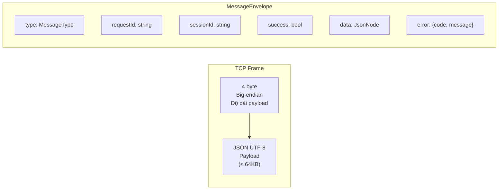
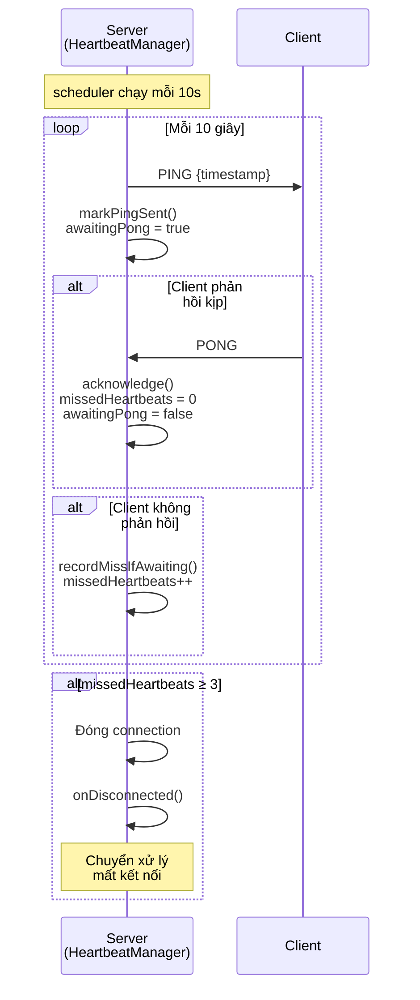
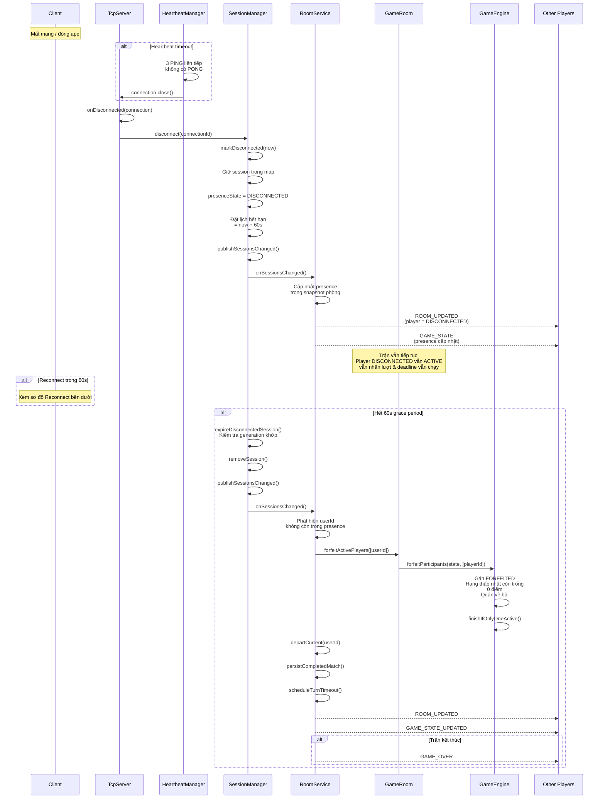
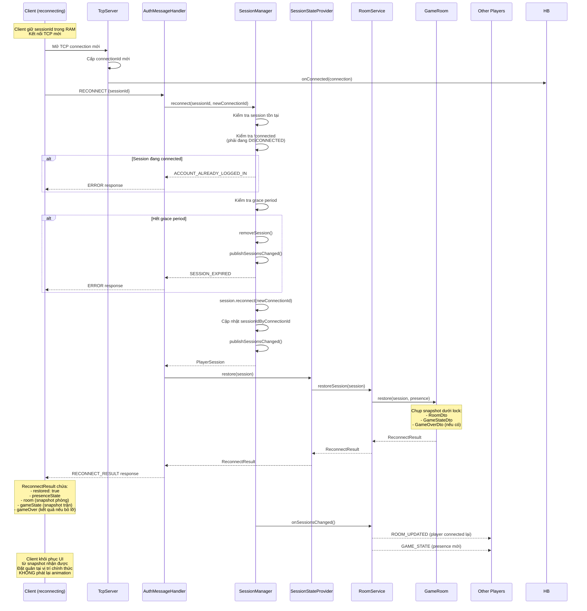
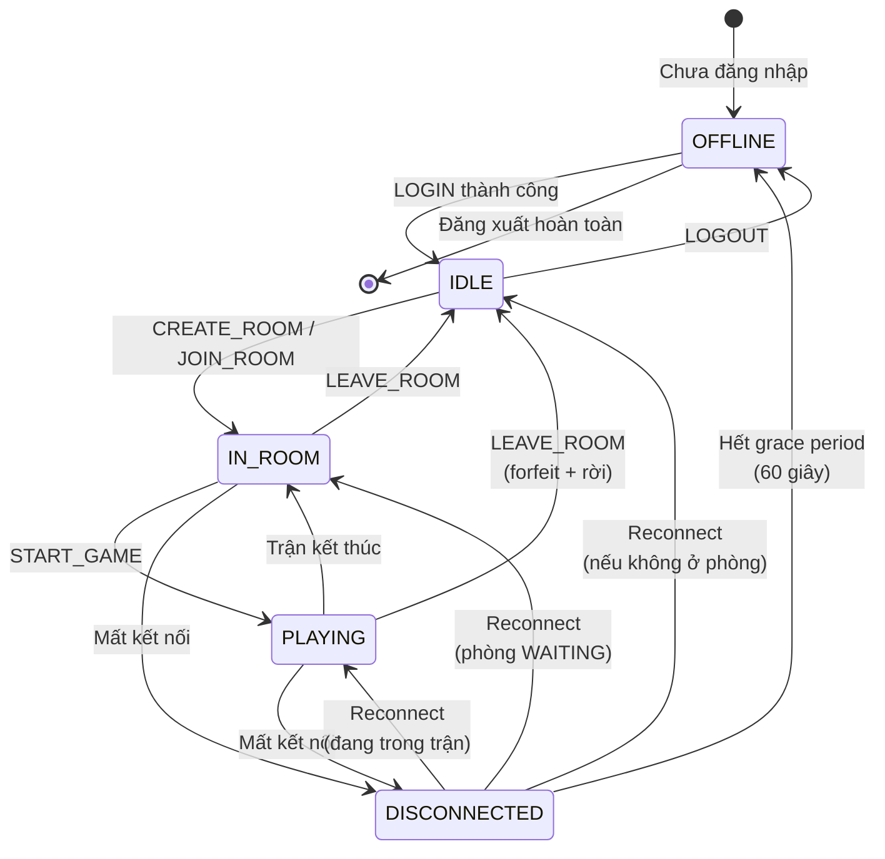

# Sơ đồ Kết nối, Heartbeat & Khôi phục phiên

## Giao thức TCP Framing

## Luồng Heartbeat (PING/PONG)

## Luồng Mất kết nối & Grace Period

## Luồng Reconnect

## Trạng thái hiện diện (PlayerPresenceState)

