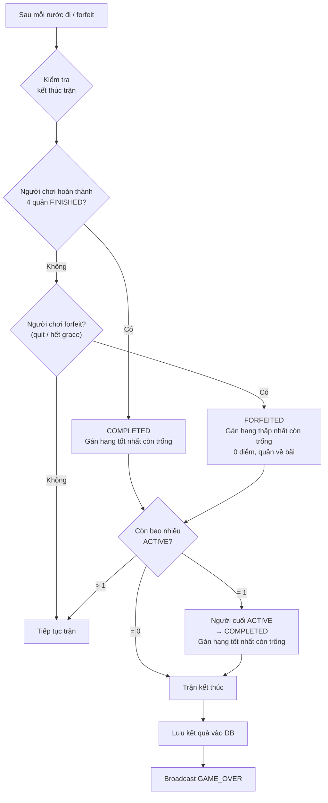
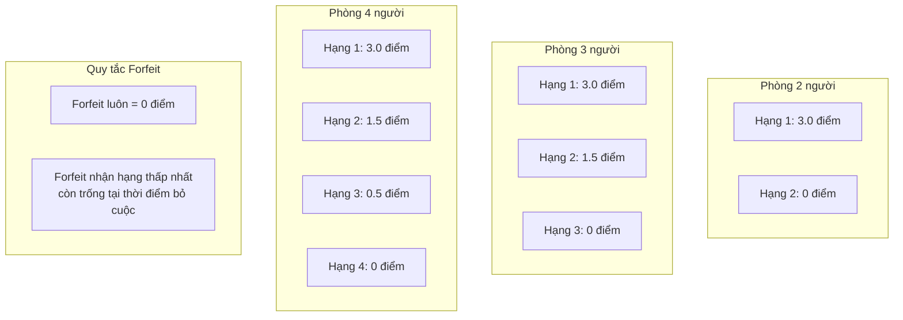
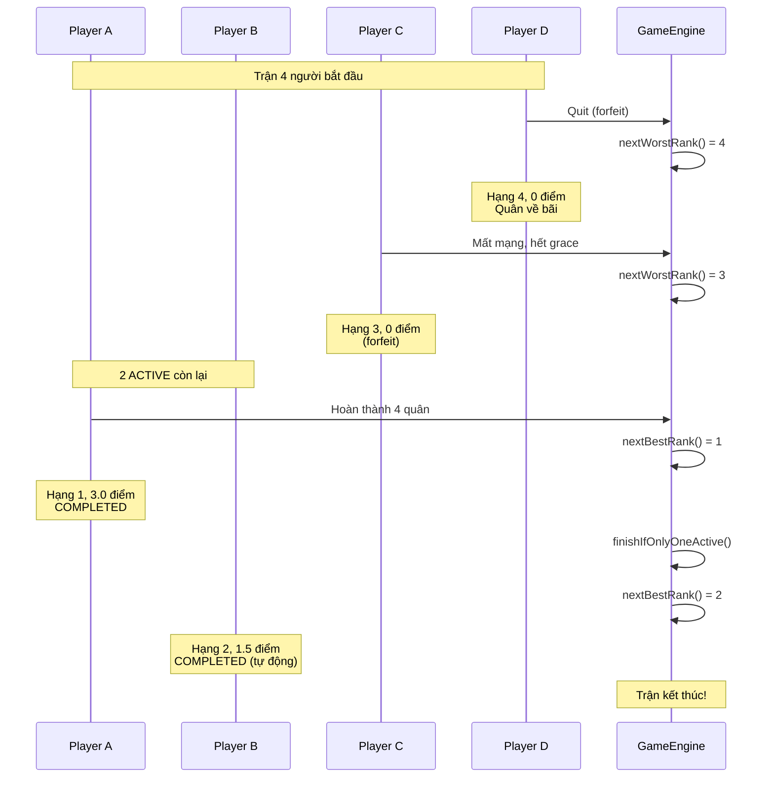
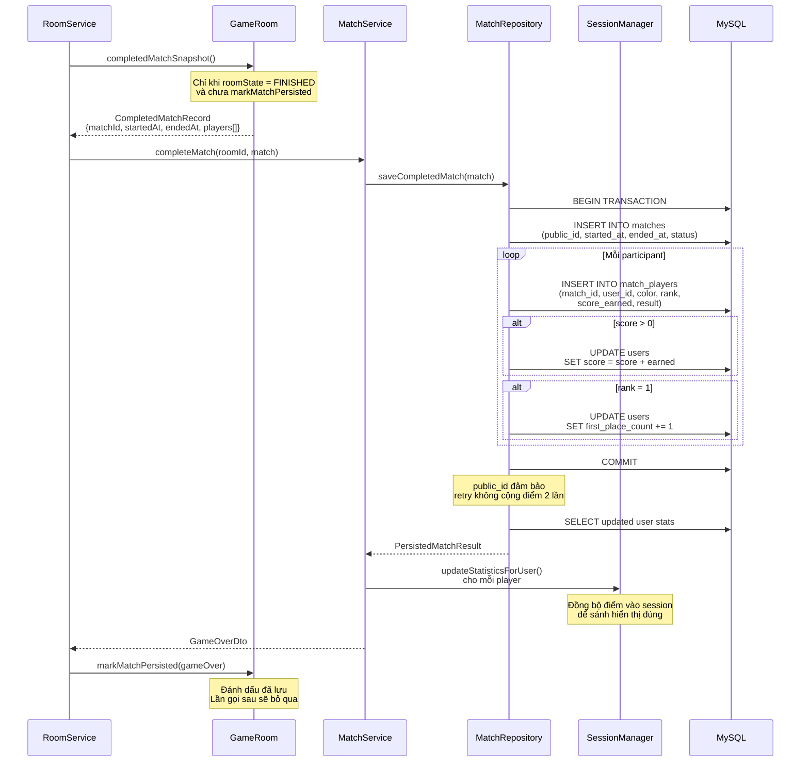
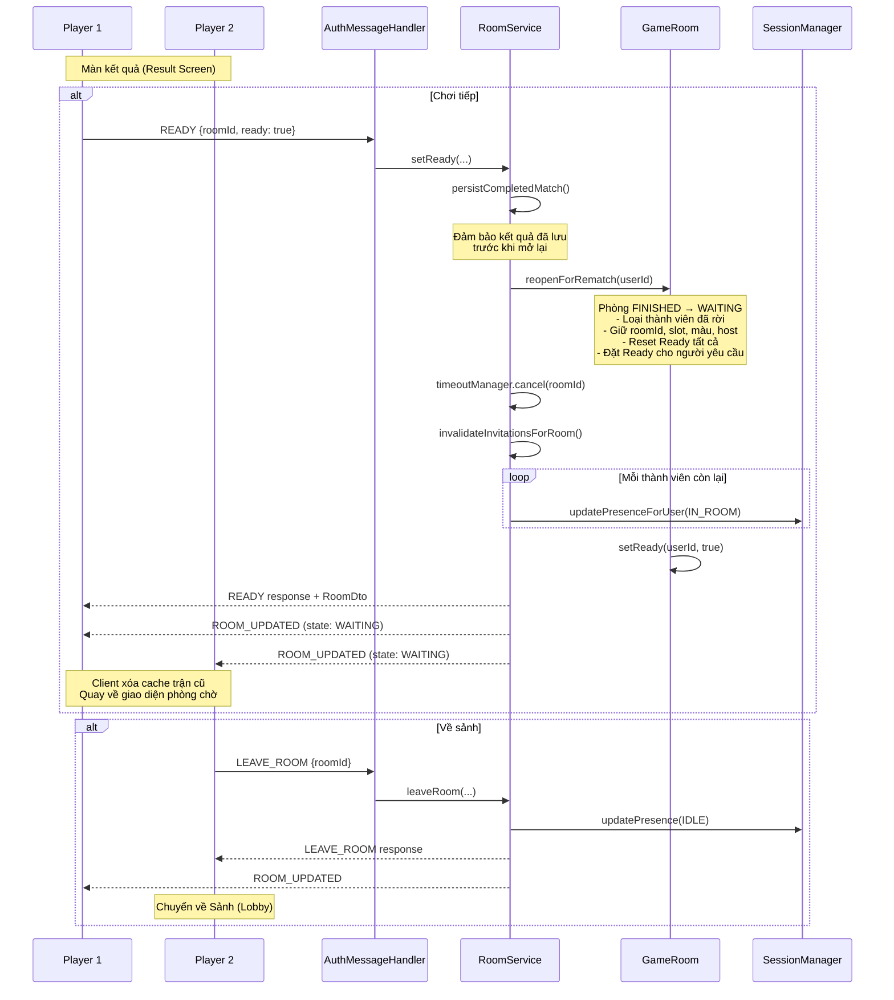
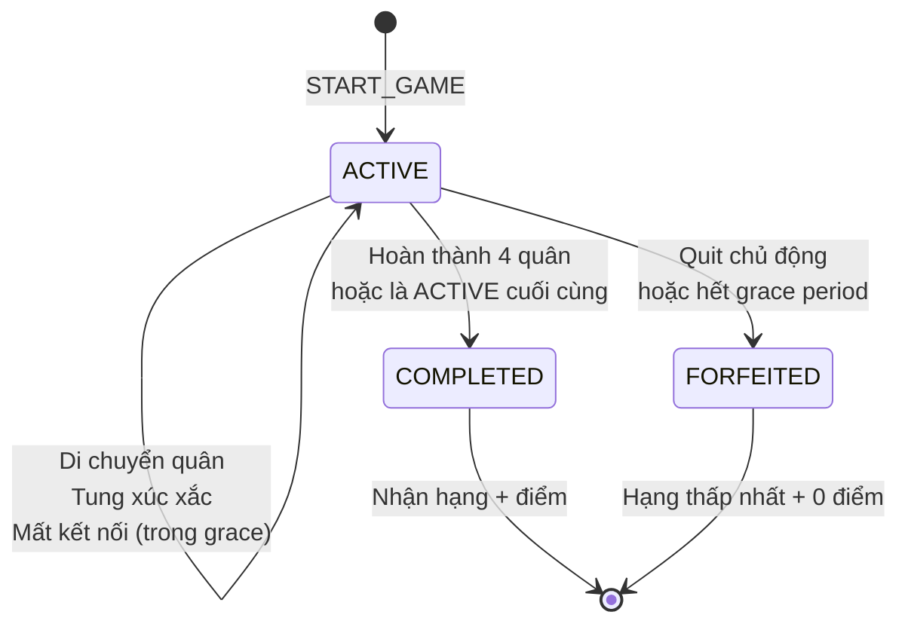

# Sơ đồ Kết thúc Trận, Tính điểm & Chơi lại

## Điều kiện kết thúc trận

## Hệ thống tính điểm

## Ví dụ tính hạng (4 người)

## Luồng lưu kết quả (persistCompletedMatch)

## Luồng Chơi lại (Rematch)

## Vòng đời participant trong trận (MatchParticipantStatus)

