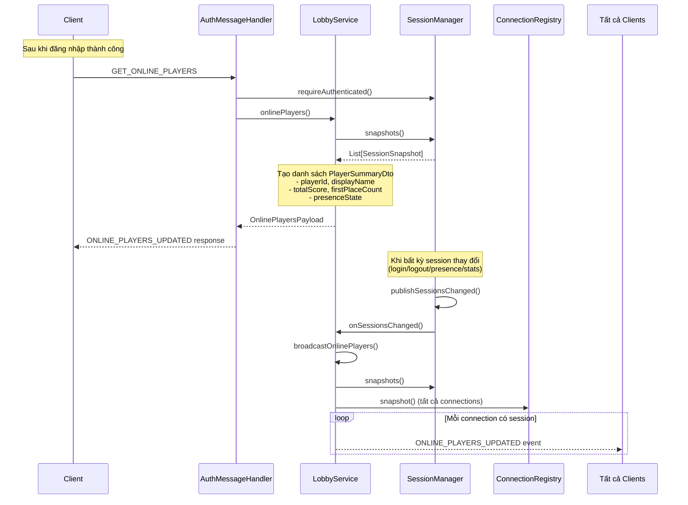
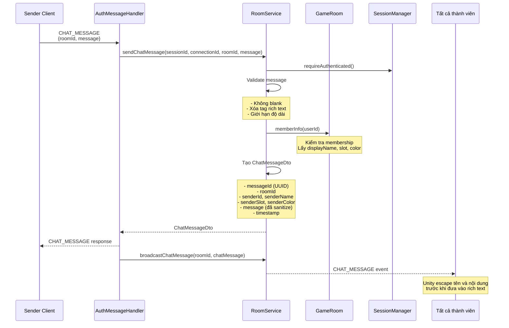
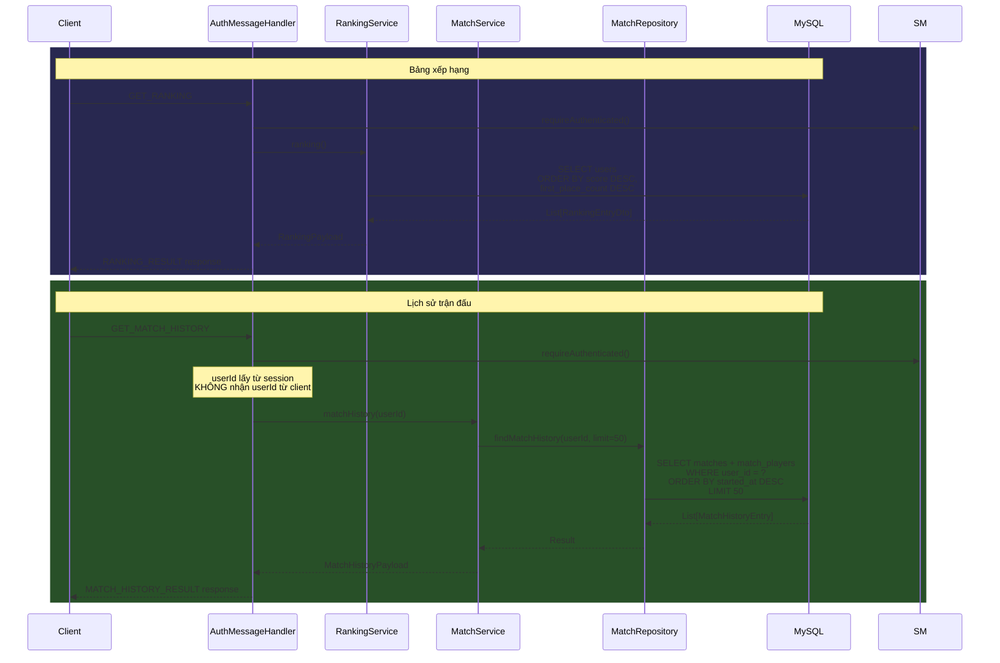
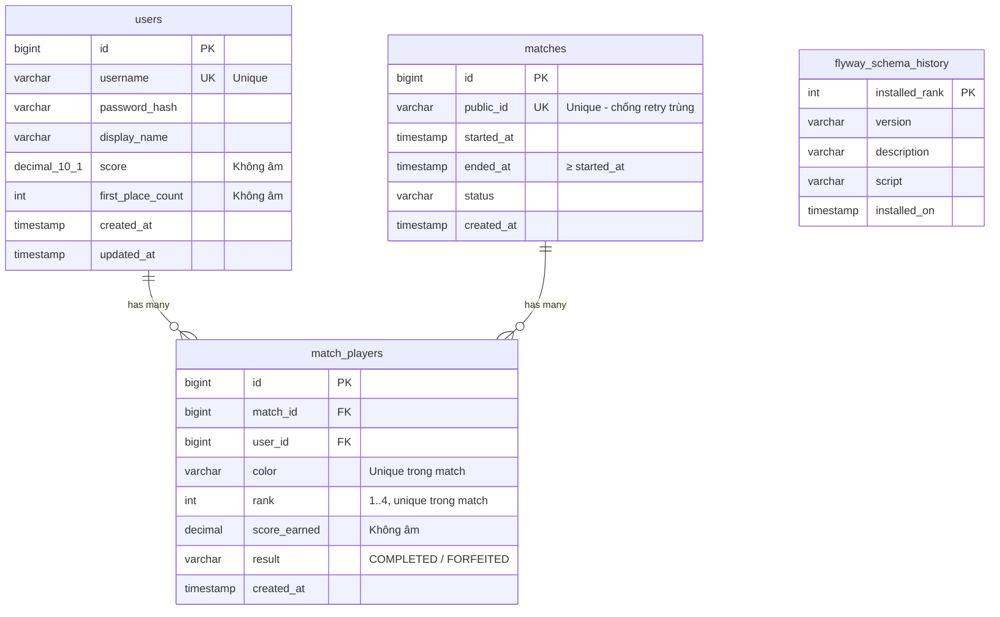

# Sơ đồ Sảnh, Chat, Xếp hạng & Lịch sử

## Luồng Sảnh (Lobby) — Danh sách Online

```mermaid
sequenceDiagram
    participant C as Client
    participant AMH as AuthMessageHandler
    participant LS as LobbyService
    participant SM as SessionManager
    participant CR as ConnectionRegistry
    participant AllClients as Tất cả Clients

    Note over C: Sau khi đăng nhập thành công

    C->>AMH: GET_ONLINE_PLAYERS
    AMH->>SM: requireAuthenticated()
    AMH->>LS: onlinePlayers()
    LS->>SM: snapshots()
    SM-->>LS: List[SessionSnapshot]
    Note over LS: Tạo danh sách PlayerSummaryDto<br/>- playerId, displayName<br/>- totalScore, firstPlaceCount<br/>- presenceState

    LS-->>AMH: OnlinePlayersPayload
    AMH-->>C: ONLINE_PLAYERS_UPDATED response

    Note over SM: Khi bất kỳ session thay đổi<br/>(login/logout/presence/stats)

    SM->>SM: publishSessionsChanged()
    SM->>LS: onSessionsChanged()
    LS->>LS: broadcastOnlinePlayers()

    LS->>SM: snapshots()
    LS->>CR: snapshot() (tất cả connections)

    loop Mỗi connection có session
        LS-->>AllClients: ONLINE_PLAYERS_UPDATED event
    end
```

## Luồng Chat trong Phòng

```mermaid
sequenceDiagram
    participant Sender as Sender Client
    participant AMH as AuthMessageHandler
    participant RS as RoomService
    participant GR as GameRoom
    participant SM as SessionManager
    participant Members as Tất cả thành viên

    Sender->>AMH: CHAT_MESSAGE<br/>{roomId, message}
    AMH->>RS: sendChatMessage(sessionId, connectionId, roomId, message)

    RS->>SM: requireAuthenticated()

    RS->>RS: Validate message
    Note over RS: - Không blank<br/>- Xóa tag rich text<br/>- Giới hạn độ dài

    RS->>GR: memberInfo(userId)
    Note over GR: Kiểm tra membership<br/>Lấy displayName, slot, color

    RS->>RS: Tạo ChatMessageDto
    Note over RS: - messageId (UUID)<br/>- roomId<br/>- senderId, senderName<br/>- senderSlot, senderColor<br/>- message (đã sanitize)<br/>- timestamp

    RS-->>AMH: ChatMessageDto
    AMH-->>Sender: CHAT_MESSAGE response

    AMH->>RS: broadcastChatMessage(roomId, chatMessage)
    RS-->>Members: CHAT_MESSAGE event

    Note over Members: Unity escape tên và nội dung<br/>trước khi đưa vào rich text
```

## Luồng Bảng xếp hạng & Lịch sử trận

```mermaid
sequenceDiagram
    participant C as Client
    participant AMH as AuthMessageHandler
    participant RKS as RankingService
    participant MS as MatchService
    participant MR as MatchRepository
    participant DB as MySQL

    rect rgb(40, 40, 80)
        Note over C,DB: Bảng xếp hạng
        C->>AMH: GET_RANKING
        AMH->>SM: requireAuthenticated()
        AMH->>RKS: ranking()
        RKS->>DB: SELECT users<br/>ORDER BY score DESC,<br/>first_place_count DESC
        DB-->>RKS: List[RankingEntryDto]
        RKS-->>AMH: RankingPayload
        AMH-->>C: RANKING_RESULT response
    end

    rect rgb(40, 80, 40)
        Note over C,DB: Lịch sử trận đấu
        C->>AMH: GET_MATCH_HISTORY
        AMH->>SM: requireAuthenticated()
        Note over AMH: userId lấy từ session<br/>KHÔNG nhận userId từ client

        AMH->>MS: matchHistory(userId)
        MS->>MR: findMatchHistory(userId, limit=50)
        MR->>DB: SELECT matches + match_players<br/>WHERE user_id = ?<br/>ORDER BY started_at DESC<br/>LIMIT 50
        DB-->>MR: List[MatchHistoryEntry]
        MR-->>MS: Result
        MS-->>AMH: MatchHistoryPayload
        AMH-->>C: MATCH_HISTORY_RESULT response
    end
```

## Sơ đồ Cơ sở dữ liệu (ER Diagram)

```mermaid
erDiagram
    users {
        bigint id PK
        varchar username UK "Unique"
        varchar password_hash
        varchar display_name
        decimal_10_1 score "Không âm"
        int first_place_count "Không âm"
        timestamp created_at
        timestamp updated_at
    }

    matches {
        bigint id PK
        varchar public_id UK "Unique - chống retry trùng"
        timestamp started_at
        timestamp ended_at "≥ started_at"
        varchar status
        timestamp created_at
    }

    match_players {
        bigint id PK
        bigint match_id FK
        bigint user_id FK
        varchar color "Unique trong match"
        int rank "1..4, unique trong match"
        decimal score_earned "Không âm"
        varchar result "COMPLETED / FORFEITED"
        timestamp created_at
    }

    flyway_schema_history {
        int installed_rank PK
        varchar version
        varchar description
        varchar script
        timestamp installed_on
    }

    users ||--o{ match_players : "has many"
    matches ||--o{ match_players : "has many"
```
