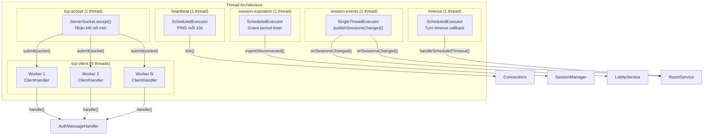
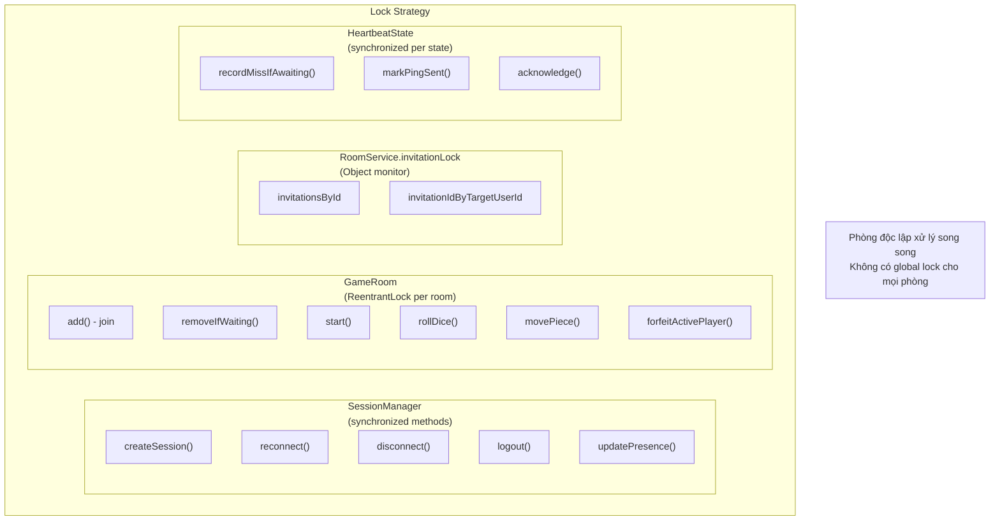
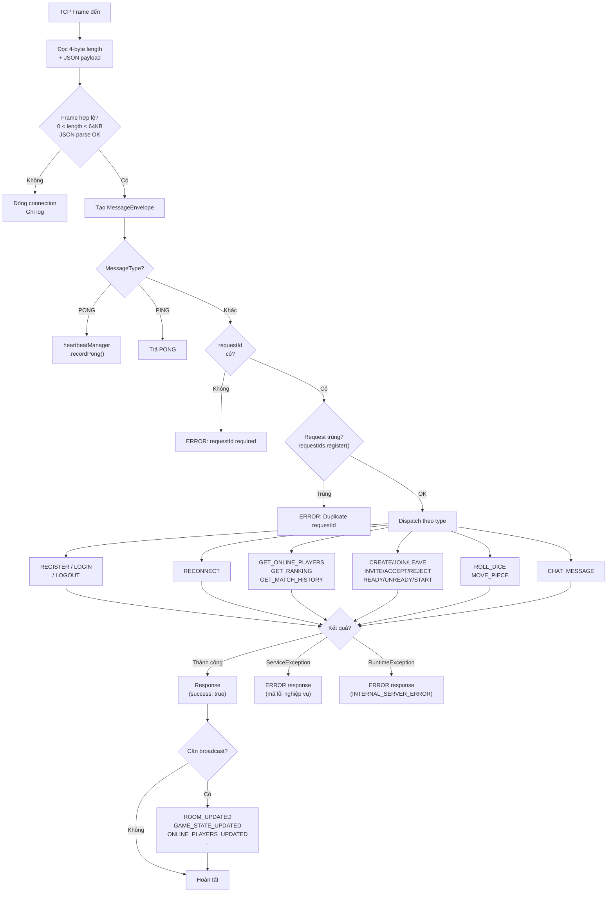
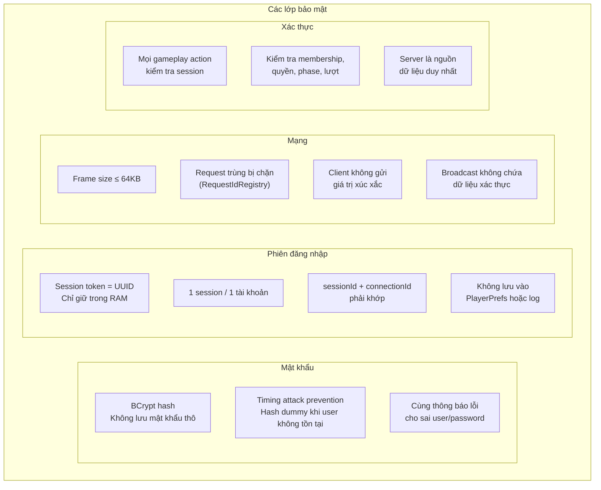

# Sơ đồ Đồng thời, Bảo mật & Xử lý Message

## Mô hình Thread của Server

```mermaid
graph TB
    subgraph Threads["Thread Architecture"]
        subgraph AcceptThread["tcp-accept (1 thread)"]
            AT["ServerSocket.accept()<br/>Nhận kết nối mới"]
        end

        subgraph WorkerPool["tcp-client (N threads)"]
            W1["Worker 1<br/>ClientHandler"]
            W2["Worker 2<br/>ClientHandler"]
            WN["Worker N<br/>ClientHandler"]
        end

        subgraph HeartbeatThread["heartbeat (1 thread)"]
            HB["ScheduledExecutor<br/>PING mỗi 10s"]
        end

        subgraph SessionThread["session-expiration (1 thread)"]
            SE["ScheduledExecutor<br/>Grace period timer"]
        end

        subgraph EventThread["session-events (1 thread)"]
            EV["SingleThreadExecutor<br/>publishSessionsChanged()"]
        end

        subgraph TimeoutThread["timeout (1 thread)"]
            TO["ScheduledExecutor<br/>Turn timeout callback"]
        end
    end

    AT -->|"submit(socket)"| W1 & W2 & WN
    W1 & W2 & WN -->|"handle()"| AMH["AuthMessageHandler"]
    HB -->|"tick()"| Connections
    SE -->|"expireDisconnected()"| SM["SessionManager"]
    EV -->|"onSessionsChanged()"| LS["LobbyService"] & RS["RoomService"]
    TO -->|"handleScheduledTimeout()"| RS
```

## Mô hình Lock

```mermaid
graph TB
    subgraph Locks["Lock Strategy"]
        subgraph SessionLock["SessionManager<br/>(synchronized methods)"]
            SL1["createSession()"]
            SL2["reconnect()"]
            SL3["disconnect()"]
            SL4["logout()"]
            SL5["updatePresence()"]
        end

        subgraph RoomLock["GameRoom<br/>(ReentrantLock per room)"]
            RL1["add() - join"]
            RL2["removeIfWaiting()"]
            RL3["start()"]
            RL4["rollDice()"]
            RL5["movePiece()"]
            RL6["forfeitActivePlayer()"]
        end

        subgraph InvitationLock["RoomService.invitationLock<br/>(Object monitor)"]
            IL1["invitationsById"]
            IL2["invitationIdByTargetUserId"]
        end

        subgraph HBLock["HeartbeatState<br/>(synchronized per state)"]
            HL1["recordMissIfAwaiting()"]
            HL2["markPingSent()"]
            HL3["acknowledge()"]
        end
    end

    Note1["Phòng độc lập xử lý song song<br/>Không có global lock cho mọi phòng"]
```

## Luồng xử lý Message tổng quan

```mermaid
flowchart TD
    TCP["TCP Frame đến"] --> Parse["Đọc 4-byte length<br/>+ JSON payload"]
    
    Parse --> Validate1{"Frame hợp lệ?<br/>0 < length ≤ 64KB<br/>JSON parse OK"}
    Validate1 -->|Không| Close1["Đóng connection<br/>Ghi log"]
    Validate1 -->|Có| Envelope["Tạo MessageEnvelope"]

    Envelope --> TypeCheck{"MessageType?"}
    
    TypeCheck -->|PONG| RecordPong["heartbeatManager<br/>.recordPong()"]
    TypeCheck -->|PING| SendPong["Trả PONG"]
    TypeCheck -->|Khác| ReqCheck{"requestId<br/>có?"}
    
    ReqCheck -->|Không| ErrReq["ERROR: requestId required"]
    ReqCheck -->|Có| DupCheck{"Request trùng?<br/>requestIds.register()"}
    
    DupCheck -->|Trùng| ErrDup["ERROR: Duplicate requestId"]
    DupCheck -->|OK| Dispatch["Dispatch theo type"]

    Dispatch --> Auth["REGISTER / LOGIN<br/>/ LOGOUT"]
    Dispatch --> Reconnect["RECONNECT"]
    Dispatch --> Lobby["GET_ONLINE_PLAYERS<br/>GET_RANKING<br/>GET_MATCH_HISTORY"]
    Dispatch --> RoomOps["CREATE/JOIN/LEAVE<br/>INVITE/ACCEPT/REJECT<br/>READY/UNREADY/START"]
    Dispatch --> GameOps["ROLL_DICE<br/>MOVE_PIECE"]
    Dispatch --> Chat["CHAT_MESSAGE"]

    Auth & Reconnect & Lobby & RoomOps & GameOps & Chat --> Result{"Kết quả?"}

    Result -->|Thành công| Response["Response<br/>(success: true)"]
    Result -->|ServiceException| BizError["ERROR response<br/>(mã lỗi nghiệp vụ)"]
    Result -->|RuntimeException| ServerError["ERROR response<br/>(INTERNAL_SERVER_ERROR)"]

    Response --> Broadcast{"Cần broadcast?"}
    Broadcast -->|Có| BC["ROOM_UPDATED<br/>GAME_STATE_UPDATED<br/>ONLINE_PLAYERS_UPDATED<br/>..."]
    Broadcast -->|Không| Done["Hoàn tất"]
    BC --> Done
```

## Bảo mật

```mermaid
graph TB
    subgraph Security["Các lớp bảo mật"]
        subgraph Password["Mật khẩu"]
            PH1["BCrypt hash<br/>Không lưu mật khẩu thô"]
            PH2["Timing attack prevention<br/>Hash dummy khi user không tồn tại"]
            PH3["Cùng thông báo lỗi<br/>cho sai user/password"]
        end

        subgraph Session["Phiên đăng nhập"]
            SS1["Session token = UUID<br/>Chỉ giữ trong RAM"]
            SS2["1 session / 1 tài khoản"]
            SS3["sessionId + connectionId<br/>phải khớp"]
            SS4["Không lưu vào<br/>PlayerPrefs hoặc log"]
        end

        subgraph Network["Mạng"]
            NW1["Frame size ≤ 64KB"]
            NW2["Request trùng bị chặn<br/>(RequestIdRegistry)"]
            NW3["Client không gửi<br/>giá trị xúc xắc"]
            NW4["Broadcast không chứa<br/>dữ liệu xác thực"]
        end

        subgraph Auth["Xác thực"]
            AU1["Mọi gameplay action<br/>kiểm tra session"]
            AU2["Kiểm tra membership,<br/>quyền, phase, lượt"]
            AU3["Server là nguồn<br/>dữ liệu duy nhất"]
        end
    end
```
